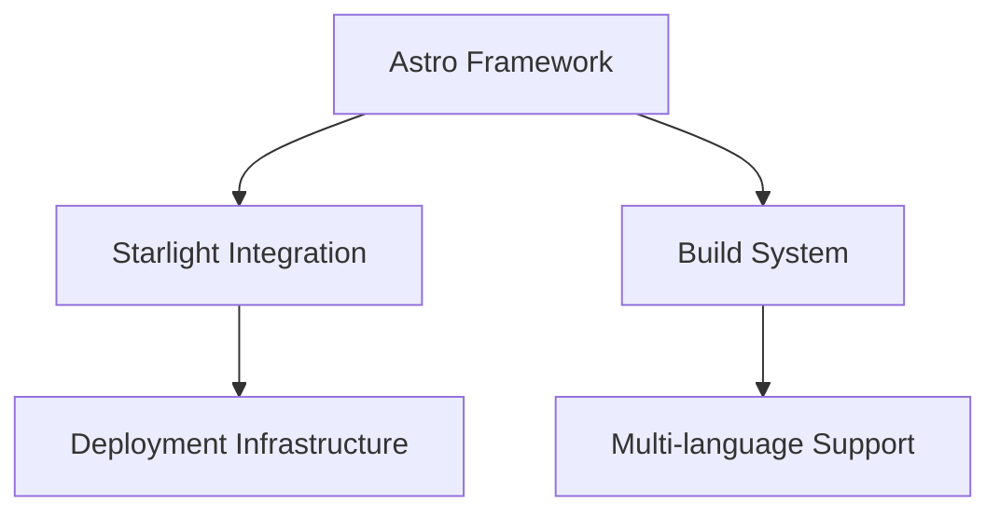

# Architecture Overview of the Genkit Documentation Site

```mermaid
graph TD;
    A[Astro Framework] --> B[Starlight Integration];
    A --> C[Build System];
    C --> D[Multi-language Support];
    B --> E[Deployment Infrastructure];
```
